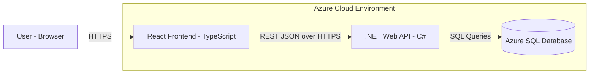

# Buckeye Marketplace — System Architecture

This document describes the high-level system architecture for Buckeye Marketplace, an OSU-themed e-commerce platform. All technical decisions are grounded in the user needs identified during Milestone 1 and prioritized to support a scalable, secure, and responsive shopping experience for students, local fans, and alumni.

---

## Architecture Diagram

---

*React and .NET are deployed on Azure App Service; Azure SQL is a managed database service in Azure.*

## Component Responsibilities
 service in Azure.
## Component Responsibilities

### React Frontend (TypeScript)
The single-page application serves as the user-facing layer. It handles product browsing, filtering, cart management, checkout flows, and admin UI screens. Administrative actions are performed through secured API endpoints. TypeScript enforces type safety across components, reducing runtime errors and improving maintainability. The frontend communicates with the backend exclusively through RESTful API calls over HTTPS, ensuring a clean **decoupling** between presentation and business logic.

### .NET Web API Backend (C#)
The backend is the central hub for business logic, authentication, and data access. It exposes a set of JSON-based REST endpoints consumed by the React frontend. Key responsibilities include user registration and login (with .edu email verification), product catalog CRUD operations, order processing, review management, and admin functions. Entity Framework Core handles data access to Azure SQL, abstracting direct SQL and supporting future schema migrations. This layer enforces **security** through token-based authentication (mechanism to be finalized in later milestones) and role-based authorization (customer vs. admin).

### Azure SQL Database
Azure SQL provides a fully managed relational database with built-in **availability** and automated backups. It stores all persistent data: users, products, orders, reviews, cart state, and gift/packaging options. A relational model was chosen because the domain has well-defined entities and relationships (e.g., users → orders → order items → products), making SQL a natural fit.

### Azure App Service (Hosting)
Both the React frontend and the .NET API are deployed to Azure App Service, which provides built-in HTTPS, automatic **scalability** (scale-up/scale-out), and CI/CD integration via GitHub Actions. This eliminates the need to manage infrastructure and supports the Cloud Deployment requirement from the Kanban board.

---

## Data Flow Examples

**User Login:** User submits credentials → React sends POST to `/api/auth/login` → .NET API validates against Azure SQL → returns an auth token/session response → React stores token and unlocks authenticated routes.

**Browse Product Catalog:** React calls GET `/api/products?category=hoodies` → .NET API queries Azure SQL with filters → returns JSON array → React renders product cards with prices and ratings.

**Checkout:** React submits cart contents via POST `/api/orders` → .NET API validates inventory, calculates total (including any student discount), creates order record in Azure SQL → returns order confirmation with estimated delivery or pickup details.

**Leave a Review:** Authenticated user submits POST `/api/reviews` with product ID, rating, and comment → .NET API verifies purchase history in Azure SQL → stores review → updates product average rating.

---

## How This Architecture Supports Milestone 1 Personas

- **Maya Chen (Budget-Conscious Student):** The .NET API includes a dedicated authentication endpoint that verifies `.edu` email addresses, enabling automatic student discount logic at checkout. The React frontend displays all-in pricing (item + tax + shipping) transparently on the product page, directly addressing Maya's frustration with hidden costs and sticker shock.
  - *Linked Must-Have Features:* User Registration & Login, Shopping Cart, Product Catalog, Cloud Deployment

- **Marcus Williams (Last-Minute Local Fan):** The decoupled REST API enables fast, lightweight checkout flows with minimal page reloads—critical for a user who abandons carts at the first sign of friction. Azure SQL stores real-time inventory and order status, allowing the frontend to show delivery countdowns and campus pickup availability so Marcus can guarantee game-day readiness.
  - *Linked Must-Have Features:* Shopping Cart, Product Catalog, Transparent All-In Pricing, Cloud Deployment

- **Dr. Trish Okonkwo (Gift-Giving Alumna):** The database schema supports gift packaging options, personalized notes, and order tracking fields. The API exposes these as part of the order creation payload, and the React frontend surfaces them during checkout. Azure App Service's reliability and HTTPS enforcement give Trish confidence that her payment and gift details are handled securely.
  - *Linked Must-Have Features:* Product Catalog, Admin Dashboard, Reviews & Ratings

---

## Assumptions & Non-Goals

- Payment processing will integrate with a third-party provider in a future milestone; the current architecture accounts for this via an extensible service layer in the .NET API.
- Mobile-native apps are out of scope; the React frontend will be responsive and mobile-friendly.
- Full-text product search and recommendation engines are deferred; basic filtering and sorting are handled by parameterized SQL queries for now.
- This document focuses on logical architecture; infrastructure-level details (VNets, firewall rules, App Service plans) will be addressed during the Cloud Deployment phase.

---
