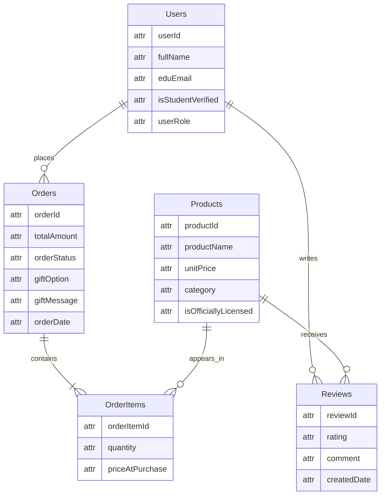

# Buckeye Marketplace — Database Schema (Big Picture)

## ERD

---

## Relationship Summary

| Relationship | Cardinality | Meaning |
|---|---|---|
| Users → Orders | One-to-Many | A user can place zero or many orders |
| Orders → OrderItems | One-to-Many (required) | Every order contains one or more line items |
| Products → OrderItems | One-to-Many | A product can appear in many order line items |
| Users → Reviews | One-to-Many | A user can write zero or many reviews |
| Products → Reviews | One-to-Many | A product can receive zero or many reviews |

OrderItems acts as the bridge entity between Orders and Products, capturing the quantity and price-at-purchase for each line item. This allows a single order to contain multiple products and a single product to appear across many orders.

---

## How This Schema Supports Milestone 1 Personas

**Maya Chen (Budget-Conscious Student):** The Users table stores **`Users.eduEmail`** and **`Users.isStudentVerified`**, enabling the application to automatically verify `.edu` email addresses and apply student discounts at checkout. Combined with **`Orders.totalAmount`** (which reflects the final all-in price), Maya can see exactly what she will pay before confirming — directly addressing her frustration with sticker shock and hidden costs.

**Marcus Williams (Last-Minute Local Fan):** The Orders table includes **`Orders.orderStatus`**, which supports real-time order tracking from placement through fulfillment. **`Orders.totalAmount`** stores the complete price (item + tax + shipping) so Marcus is never surprised by hidden fees at checkout — the exact pain point that causes him to abandon carts. The OrderItems table captures **`OrderItems.priceAtPurchase`** to lock in the price at the time of order, ensuring pricing transparency.

**Dr. Trish Okonkwo (Gift-Giving Alumna):** The Products table includes **`Products.isOfficiallyLicensed`**, giving Trish confidence that she is purchasing authentic OSU merchandise. The Orders table stores **`Orders.giftOption`** and **`Orders.giftMessage`**, allowing her to add premium packaging and a personalized note during checkout — addressing her core frustration that most sites ship items in plain poly bags with no gift-ready presentation.

## AI Usage

AI tools (Claude Opus 4.6) were used to assist with brainstorming and drafting the initial ERD structure and documentation. 

All design decisions, schema structure, and explanations were reviewed, modified, and finalized by the student to ensure alignment with course requirements and Milestone 1 personas.

